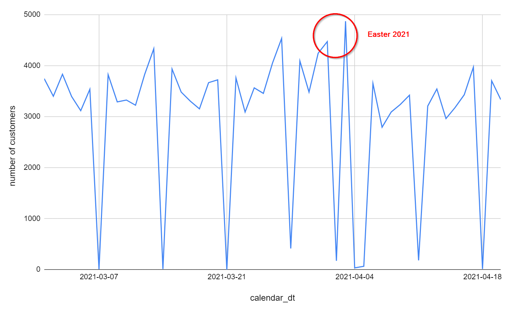
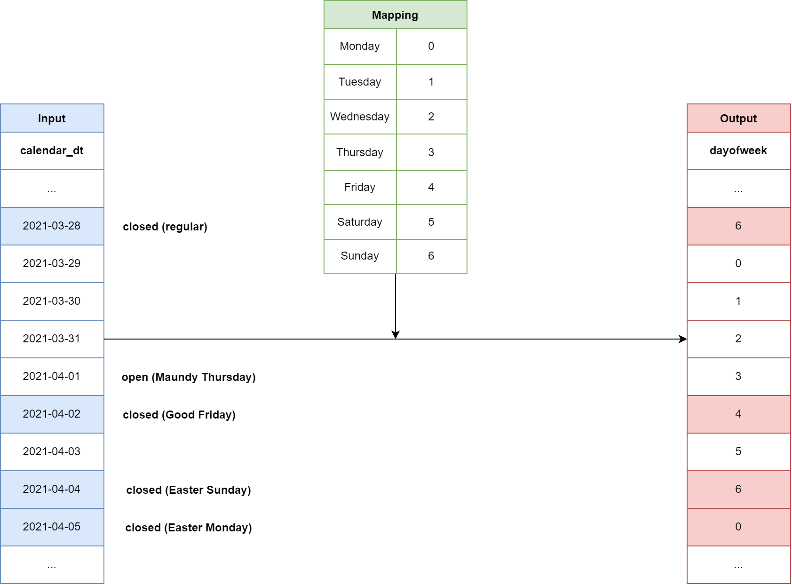
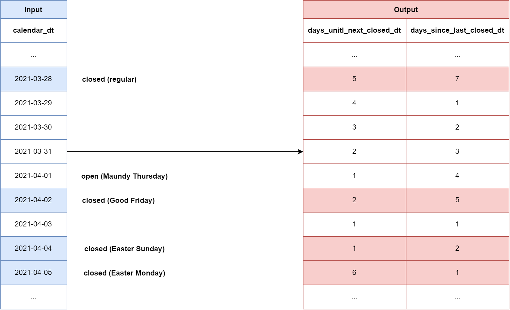
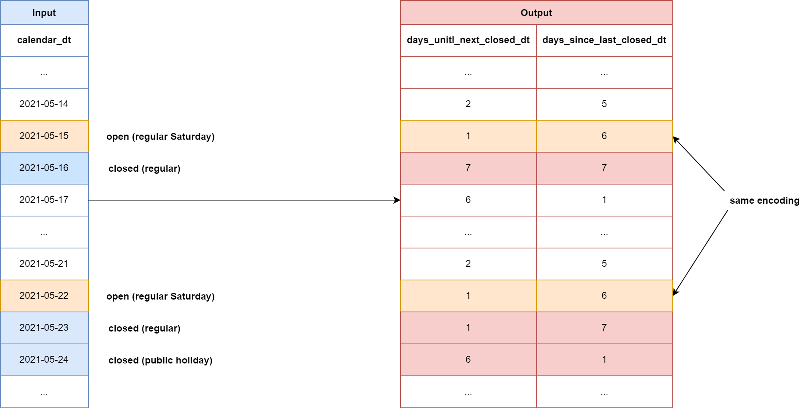
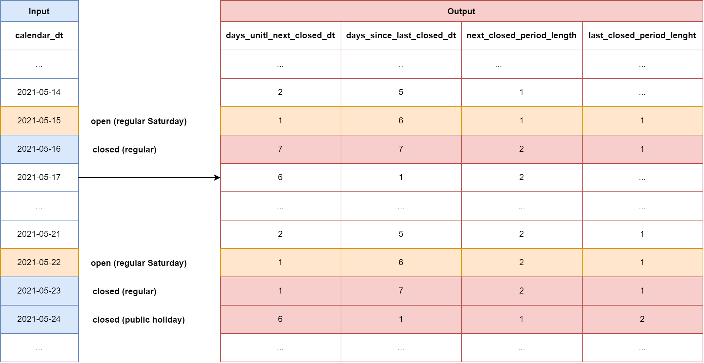

# Encoding Temporal Features (Part 1)
## How to teach public holidays to Deep Neural Networks (DNN)
---
When working with real-world time series, sooner or later we stumble across public holidays, which show up as anomalies in otherwise very robust pattern. For example, in the retail industry, we usually observe very strong weekly seasonality. But during Easter this pattern is broken mainly because shops are closed exceptionally on Good Friday and Easter Monday. At the same time we see a peak in the number of customers on Maundy Thursday and on Easter Saturday. It seems customers stock up with the most necessary for the holidays (see plot of a retail store in Switzerland).

As a Data Scientist you might wonder how you can teach a Deep Neural Network (DNN) such a holiday effect. Therefore, it's inevitable to encode the pure *calendar_dt* into something, that a DNN can then digest more easily. In this blog post we will cover some methods to do so.

# Naive Approach

A first approach which comes to my mind, which is indeed very naive, is the following: Encode *calendar_dt* by the corresponding weekday. 

Clearly, this enables the DNN to learn weekly pattern. You might even add the month of the year for a particular *calendar_dt*. This would help train a finer distinction between days and even allow the DNN to recognize holidays that occur on, say, the third Thursday of a given month.

Unfortunately, this approach will not be successful for other holidays such as Easter, since the assigned date for Easter shifts every year within a certain period of time. Therefore, imagine our DNN learned based on a year where Easter was in the first week of April. If we apply such a model to get some predictions for a new year, it will again show the Easter pattern in the first week of April, while this year Easter might be already in March.

Hence, we need a more sophisticated approach to deal with such flexible holidays.

# Relative Position between closed Days

Let's imagine we have some retail data, which show a strong weekly pattern with a low performing Sunday due to some opening hour restriction (e.g., it is still common in Europe for retail stores to be closed on Sunday). In such a scenario, we can replace our naive approach by a more sophisticated method.

First of all, we identify all public holidays and all days with restricted business hours ("Sunday"). In a second step, we count the number of days until the next day, resp. since the last day, having restricted business hours. These two numbers will form a 2-dimensional vector, where each entry represents the distance to a particular surrounding closed day (see diagram above).

The main advantage of this method is that our DNN is now able to detect specific patterns around public holidays like the Easter pattern which we have seen above. Moreover, since the pattern itself is kind of robust across different years, the network can apply it to unseen data, although the particular *calendar_dts* are not the same.

It's worth noting that the advantage we gained from the naive approach remains with this system. A DNN can still distinct weekdays from each others, like it does with the former approach. Moreover, in weeks without a public holiday, the same weekdays are always encoded the same way. Thus, the DNN is capable of learning weekly seasonality.

# Adding closed periods as additional Dimensions
It is likely that there is a different pattern before several consecutive closed days than before just one. Unfortunately, the above approach falls short representing this reality. To illustrate: Imagine a holiday on a Monday. If we now apply the above encoding to the previous Saturday, this looks exactly like a normal Saturday, although this Saturday is now followed by two consecutive closed days, which can have a strong impact on customer shopping behavior. Unfortunately, a DNN using the above encoding cannot identify this pattern.

There are two main ways to deal with this problem. Either we improve our encoding of *calendar_dt* or we change the type of the model into a Recurrent Neural Network (RNN), which also takes the surrounding dates into account. Since the second approach is out of scope for this blog post, we will focus on the first method.

We have already seen how to encode *calendar_dt* into a two-dimensional vector. By adding two more dimensions we can also solve the above problem. These two dimensions encode the length of the next closed period, resp. last closed period, similar to what we did when we encoded the *calendar_dt* into its relative position. This 4-dimensional vector then allows our model to identify peaks before a longer period of consecutive closed days.

# Possible Further Improvements
We have seen that smart encoding *calendar_dt* allows our DNN to detect pattern before a closed day and therefore adjust its parameters accordingly. This works excellently for retail stores with limited opening hours on Sunday. But how should we deal with a retail store that is open around the clock? 

Applying our method from above would result in a garbage encoding where all values are infinite because there are no closed days. Nevertheless, there might be a measurable effect on Sunday or Christmas, which our DNN could identify if we encode the input appropriately. To do so, we shift the focus away from store  hours to the standard business hours that apply in a particular district/state/country. Then, we apply the same 4-dimensional encoding of the input date.
Alternatively, it is even possible to combine the coding of store hours with the coding of districts, if we handle both types of stores at the same time. This would result in a 8-dimensional vector.

# Conclusions
In retail, public holidays like Christmas or a National Celebration Day play a crucial role in the expected number of customers. However, predicting these customer numbers requires encoding the *calendar_dt* into something more digestible for a DNN. In this post we have discussed various possibilities and finally arrived at a method that encodes *calendar_dt* into a 4-dimensional vector. Two of these four dimensions encode the relative position of an input *calendar_dt* to its surrounding closed days. The other two dimensions then describe the length of these closed periods. 

This encoding allows a DNN to recognize patterns of public holidays in previous data and apply them to new predictions.
