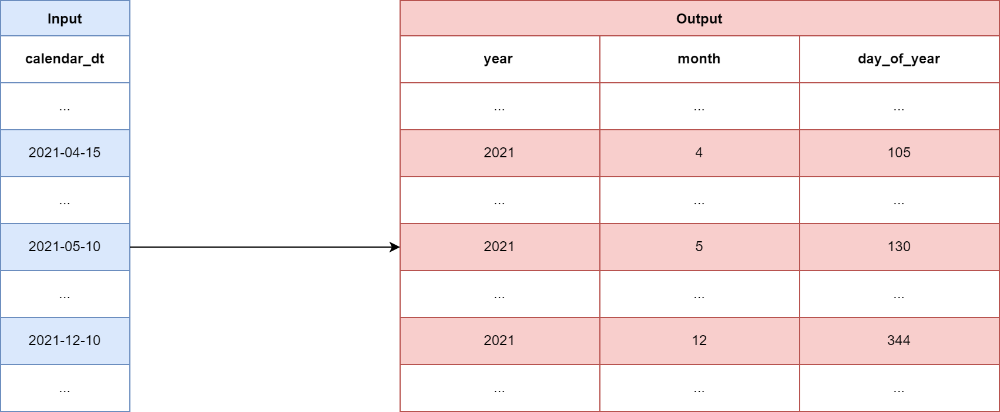
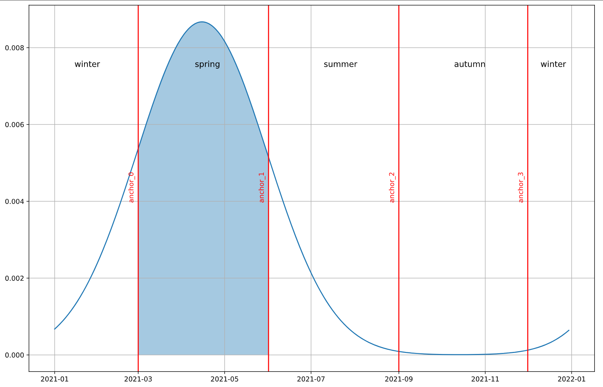
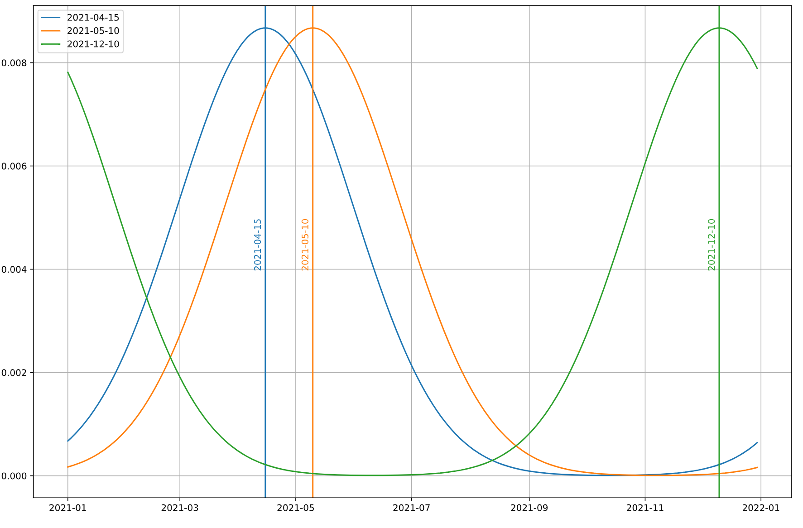
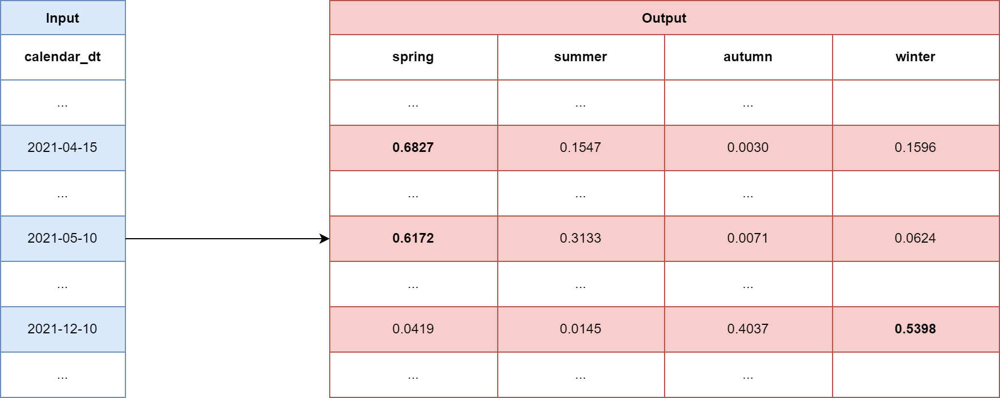

# Encoding Temporal Features (Part 2)
## How to teach seasonality to Deep Neural Networks (DNN)
---

In my last blog post, I presented a method to encode *calendar_dt* in a way that DNNs are able to learn holiday effects. Furthermore, it was even possible to use it to detect short-term seasonality such as weekly patterns. In this blog post, I want to shift the focus from this short-term seasonality to long-term patterns. 

Long-term seasonality is quite common in real data. To give just a few examples: Average temperature per day (unless you live in an equatorial area), solar flares, or even human behavior, which may well be seasonal, e.g., movie attendance decreases in the summer.

But how can you teach a DNN seasonal effects so that its predictions show them as well? 

# Common Approaches
There are basically two types of methods for dealing with long-term seasonality in time series: Decomposition and Coding. Coding methods create features based on the input date, while decomposition methods focus on filtering out the seasonal portion of the signal. Although decomposition methods can be very powerful, we will focus on coding methods in this blog post.

One such encoding technique, which is very widely used, splits the *calendar_dt* into several date components such as year, month, and day_of_year. A DNN can then learn seasonal effects based on these features by combining them with the corresponding labels.

The advantage of this approach is that it does not require any expertise, since the DNN tries to extract the information directly from the signal. But like everything in life, this advantage comes at a price. In this case, it is the amount of data needed for training, especially if the seasonality is annual or longer periodic. This becomes clear if you imagine a time series with similar values in January and December. To learn such a pattern, the DNN must combine completely different coded input data.

At Adtrac we have found a way to deal with such problems by supporting the DNN with more informative features. Let's take a look at how this works.

# Features based on Similarity
The basic idea of our coding is that we introduce similarity of different data. This similarity is defined by several dimensions. For example, days that are adjacent to each other should have similar values in all dimensions, while days that are separated by months should have less similar feature values. So how can we achieve this?

## Set Anchors based on Prior
In a first step, we use our prior knowledge about the specific time series or from the domain to define relevant date ranges. 
For example, if our time series has a monthly pattern, we will use months as relevant date ranges. On the other hand, if we think our data correlates more with the seasons, we will define our date ranges as spring, summer, autumn, and winter.

After we have defined the relevant date ranges, we set an anchor for each range. Normally we use the first day of the range as an anchor, although it could be any other day in the range.

The number of anchors will then define the number of features we generate per input

## Calculate Values for Each Anchor

To encode *calendar_dt*, we will calculate a specific value for each of these defined date ranges. What this means exactly is best explained with an example. 

Suppose we have a seasonal prior. If we want to encode the input *2021-05-10*, we calculate how springy, how summery, how autumnal and how wintery this particular date is. 

For this we use a mixture of three normal distributions, using the corresponding *day_of_year* of the input as the mean, resp. shifted by the period length. Furthermore, the standard deviation is simply set as half of the length of the date range. But we can experiment with this value. The inputs that then go into the distribution function are the *day_of_year*-indices of a single period; in our example from 1 to 364. This gives us the probability for each index.

Finally, to get a value for each date range, we simply sum all these probabilities over all days within that range. 

To get a feel for the effects of different input dates, look at the graph below, which combines the curves for three different inputs. We notice that the curve for *2021-04-15* and *2021-05-10* is very similar, while the curve for *2021-12-10* is different.

More details can be found here: https://github.com/raphi1790/data-science-blog/tree/master/encoding_calendar_dt/part_2/code_example

## Achievement
The biggest advantage of this method is that we need much less data to teach seasonality to a DNN. It is easy to see why this is so with an example. Imagine you want to model the average daily temperature over a year. Since we are in the Northern Hemisphere, the temperature is lower in January and December. To learn such an effect with conventional approaches, a DNN needs at least a full year's data. However, with our similarity method, we do not need values from December because the encoding makes the inputs in January and December similar. Therefore, a DNN can already learn this effect from the January values. 

Some final words on the cost of this coding, since one could argue that it is computationally intensive to calculate *period_length*-values of a Gaussian mixture for each input. And it is indeed more expensive than the usual approaches, although it is still *O*(n). 
One trick to speed up the coding process is to compute all possible calendar_dts in advance. At Adtrac, for example, we have calculated all values for the next 10 years and simply merge the corresponding values as needed.

---
# Conclusion
In this blog post, we learned about different encoding methods for *calendar_dt* that help DNN deal with long-term seasonality. 
Common approaches focus on splitting the date into its parts like year and month. Unfortunately, this approach requires a large amount of data for training, which is not always given.
Therefore, at Adtrac we have developed a different method that requires less data, but requires some expertise. The main idea is to code data across multiple dimensions in such a way that similar inputs produce similar features.  However, what is similar requires some prior knowledge; for example, all days in spring may be similar.
Ultimately, this coding allows a DNN to learn long-term seasonality very efficiently.

A complete example can be found here: https://github.com/raphi1790/data-science-blog/tree/master/encoding_calendar_dt/part_2/code_example