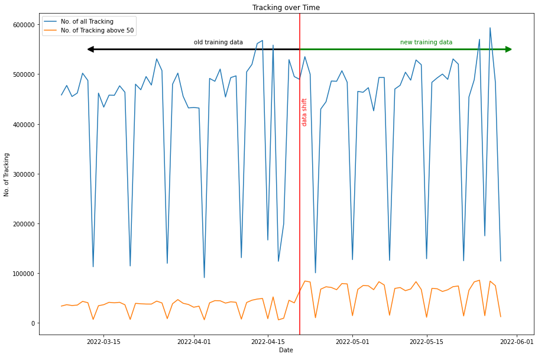
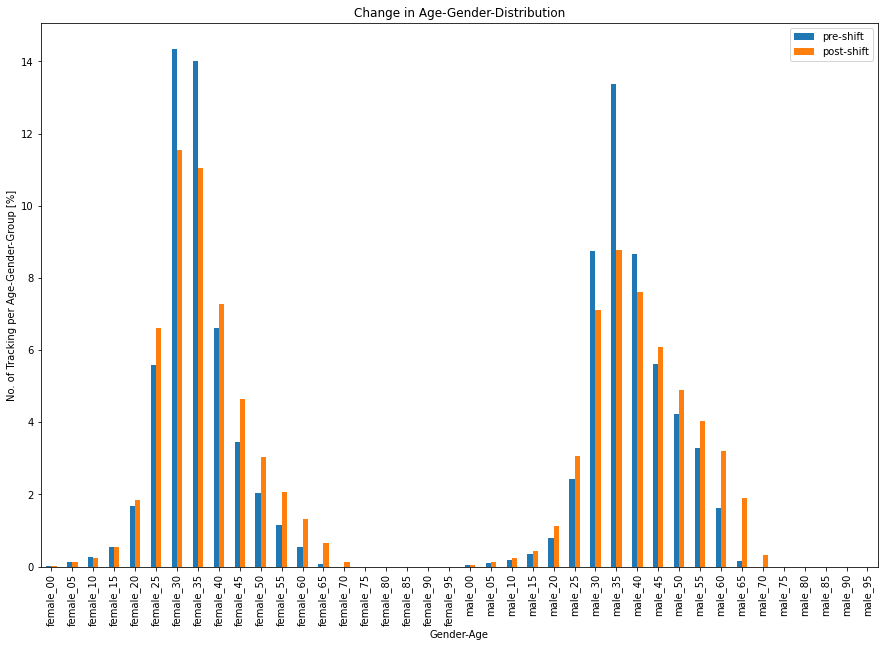
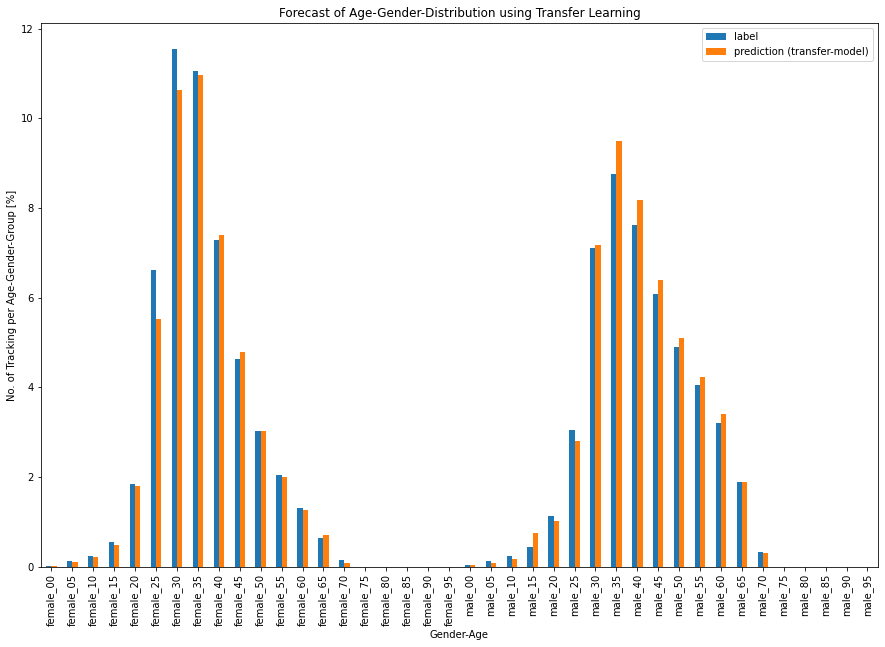
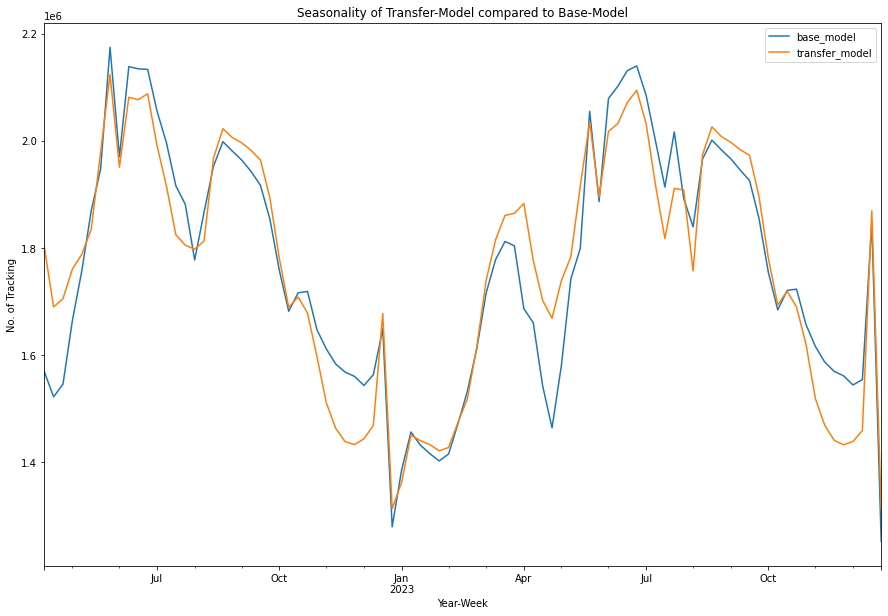

# Forecasting with Transfer Learning
## How Transfer Learning can help with Shifts in Data

Shifts in the data can occur at any time. Often they cause time series models to stop making accurate predictions from one day to the next. To better understand this issue, let's look at the following situation in detail.

The company you work for collects data on people flows at specific points. Specifically, for every single person that passes by, the age as well as the gender are determined and stored using a computer vision algorithm. 
Your job as a Data Scientist is to take this data, which has been collected for years, and develop a model that forecasts people flows for each age-gender group for the future; that is, a time series prediction for all age-gender groups individually.
You perform this task with the help of a neural network, noting with satisfaction that the model also reproduces the annual seasonalities. Since everything is in order, this forecast model is put into production.

After some time you realize that the predicted age-gender distribution does not correspond to reality anymore. Your research reveals that these distortions are related to the removal of the Corona mask requirement. It appears that the computer vision algorithm, estimates individuals differently when no mask is worn. It still detects the same number of people in the total, but their distribution among individual groups differs from before. 
Your task is now to adapt the predictions to the new situation. Unfortunately, there are only a few weeks of new data and you wonder how you can use it to map the annual seasonality.

What sounds like a conundrum has in fact occurred exactly like this at Adtrac. This underlines that this scenario is by no means fictional, but actually occurs in reality. The question remains, however, how can we deal with it?

As always, there are various approaches. For example, one can adapt the "old" data to the new situation, or overwrite the output of the existing model with a heuristic.
Here we want to focus on a transfer learning approach that is not yet widely known and yet has met the objectives, which are:
- Age-gender distribution adjusts to the new data
- Annual seasonality is predicted similarly to the existing model

### What is Transfer Learning 
")

Transfer learning basically means transferring knowledge from a known area to a domain you don't know that much about yet.

In machine learning, this technique is often used for classification problems in computer vision. 
For example, if one wants to train a model that can distinguish different breeds of dogs, it is best to start with a general object recognition model (e.g. ResNet50). This large model can already distinguish a dog from a cat or a horse. In order to train the different dog breeds to this particular model, one needs only a few pictures of the different breeds. With these you retrain the last layers of the base model. All the first layers of the base model remain untouched and only serve to decompose the input into individual features. After this training you hopefully get a model that can assign the corresponding breed to a dog image.

The biggest advantage of this method is, that one gets along with much less training data, because the base model already contains many features and knows e.g. how an animal differs from a human.

Is there perhaps a way to solve our time series problem using this method? The short answer is yes, as we were able to show at Adtrac.

### Application of Transfer Learning to Time Series
Although our problem is different from a classification problem, analogous to the example above, we have only a few data available, which in itself is not sufficient to train a neural network from scratch. If we tried to do this with our time series, we would inevitably lose the annual seasonality, since the new training data covers only a limited time period.

However, we know that our existing model can accurately predict these seasonalities. We can now try to use this model as a baseline model, and retrain the last layers with the new data.

In Tensorflow, this can be accomplished with a few lines of code:

To analyze whether we have achieved our goal, we first look at the age-sex distribution. As the chart shows, this was completely taken over by the new data. Thus, our first goal has been met. 

Now, what about seasonality. Our hope was that the long-term time series features would be carried over from the base model. The chart now proves that these seasonal effects are also present in the new model. Consequently, the second objective set has also been met.

It should be mentioned that despite this success, no patent remedy has been found that explains how to best apply transfer learning. Our experience shows that it has to be evaluated for each problem individually.

### Conclusion
Especially for time series with a longer seasonality, changes in the labels due to various factors (suspension of corona measures, software update,...) can have large consequences, because the training of such models requires the data from at least one complete cycle. Often, however, one does not want to wait for enough new data to be available, but simply wants to adapt the existing model to the new circumstances. As a possible approach, transfer learning comes into play, which has already proven to be a promising method in classification problems. Applied to time series problems, this method can provide a way to get an update into production faster than a seasonal cycle. We have proven this at Adtrac. 

